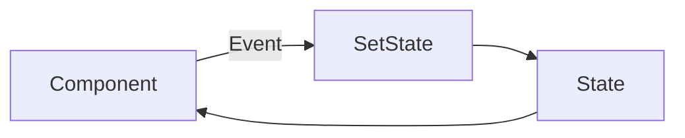
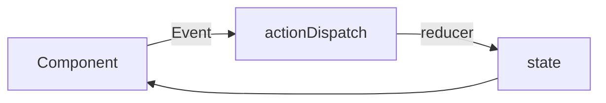
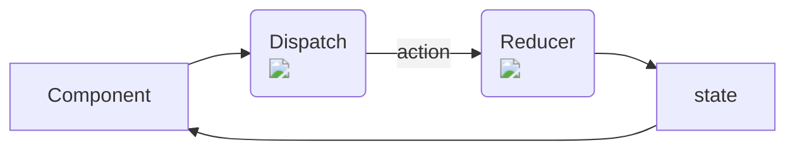
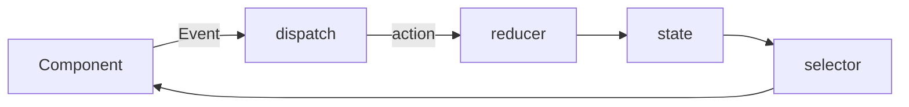

## ReduxとRTKを使えるようになろう(1)

---

# 誰に向けて？

- 🙆‍♂️
  - Reactを書いたことある人
  - Redux or ReduxToolKitを使い始めたもののよくわかってない人
  - 興味はあるがよく知らない人
- 🙅‍♂️
  - Redux or ReduxToolkitをばりばり使ってる人
  - その他の状態管理手法とのメリデメをある程度理解している人
  - そもそもReact/Reduxを知らない人

<br/>
<br/>

（比較的初学者を対象にしています）

---

# お知らせ

- 主観的内容が多分に含まれます😢
- わからない箇所があったらその場で質問という形でやろうと思います
- ReduxToolKitを使っている方はRTKの存在を一旦忘れてください
  - 簡単に書けるものの、最初の理解には向いていないので...
  - 後ほど触れます


---
layout: center
class: text-center
---

## そもそもReduxとは？

---

## 状態管理の主要な選択肢


|     |     |
| --- | --- |
| Context API | React公式 |
| unstated-next など | Context APIを扱いやすくしたもの |
| Redux or RTK | 複雑なUIに割と適している |
| recoil | experimentalだが勢いがある |
| xstate | 日本ではあまり人気なさそう | 
| MobX | 日本ではあまり人気なさそう|

などなど、、

---
layout: center
class: text-center
---

## > Reduxは状態管理の一手法でしかない <
（そんなに複雑に考えないで）
---
layout: center
class: text-center
---

## hooksのおさらい

---

# useState


```ts {all|2|6-8|all}
function Counter({initialCount}) {
  const [count, setCount] = useState<number>(initialCount);
  return (
    <>
      Count: {count}
      <button onClick={() => setCount(initialCount)}>Reset</button>
      <button onClick={() => setCount(prevCount => prevCount - 1)}>-</button>
      <button onClick={() => setCount(prevCount => prevCount + 1)}>+</button>
    </>
  );
}
```
https://ja.reactjs.org/docs/hooks-reference.html#usestate
<br/>
<br/>

<div class="flex justify-center">

</div>


---

# useReducer


```ts {all|11|13|2-9||all}
const initialState = {count: 0};
function reducer(state, action) {
  switch (action.type) {
    case 'increment':
      return {count: state.count + 1};
    default:
      throw new Error();
  }
}
function Counter() {
  const [state, dispatch] = useReducer(reducer, initialState);
  return (
      <button onClick={() => dispatch({type: 'increment'})}>-</button>
  );
}
```

https://ja.reactjs.org/docs/hooks-reference.html#usereducer

<br/>

<div class="flex justify-center">

</div>

---

# イメージ

<div class="flex justify-center">


</div>

---

# useReducerざっくり整理など

- useStateと違い、Componentは直接setStateを叩かない
  - 代わりにdispatchを叩く
- dispatchに渡しているオブジェクトをactionと呼ぶ
- dispatchされたactionはreducerへ
- reducer内のswitch-caseによりstateを決定する

<br/>

>通常、useReducer が useState より好ましいのは、複数の値にまたがる複雑な state ロジックがある場合や、前の state に基づいて次の state を決める必要がある場合です。また、useReducer を使えばコールバックの代わりに dispatch を下位コンポーネントに渡せるようになるため、複数階層にまたがって更新を発生させるようなコンポーネントではパフォーマンスの最適化にもなります。

https://ja.reactjs.org/docs/hooks-reference.html#usereducer

<div class="flex justify-center pt-8">
--
</div>

<div class="flex justify-center pt-8">
onClickするComponent側がstateを変更するためのロジックを持つ必要がなくなる
</div>

<div class="flex justify-center pt-2">
(Component側の関心が「何のactionをdispatchするか？」のみになる)
</div>

---
layout: center
class: text-center
---

なぜhooksのおさらいをしたか

---
layout: center
class: text-center
---

useReducerがわかればReduxの思想も理解しやすいから

---

# Redux
https://redux.js.org/tutorials/essentials/part-1-overview-concepts
<div class="flex justify-center pt-1">
  
</div>  
<div class="flex justify-center pt-2">
  Reducerが複数あること以外は基本useReducerと同じ
</div>


---
layout: center
class: text-center
---

## 実際のコード (todo app)

(雰囲気で書いてます)

---

# initialState

```ts

type InitialState = {
  text: string[]
}

const initialState: InitialState =  {
  text: []
}
```
todo appのstate初期値

--- 

# actionCreator

```ts
const addTodo = (text:string) => ({
  type: 'ADD_TODO',
  payload: {
    text
  }
})
```
「action」を作る関数  


---

# reducer

```ts
// reducer
const reducer = (state = initialState , action) => {
  switch (action.type) {
    case 'ADD_TODO': {
        return {
          ...state,
          text: [...state.text,action.payload.text]
        }
    }
  }
}
```
actionを受け取り、stateを更新する 

---


# store

```ts
const store = createStore(reducer)
```
stateを保持し、reducerを動かすためのdispatchを提供したりする


---


# provider

```tsx
<Provider store={Store}>
    <App />                                    
</Provider>
```
作成したstoreをReact世界につなぐ


---


# component

```tsx
const Component = () => {

  const dispatch = useDispatch();
  const text = useSelector((state) => state.text)

  return (
    <button onClick={() => {dispatch(addTodo('てきすと'))}} >Add Todo</button>
  )

}
```
何らかのeventなどにより、dispatchを叩く
selector経由でstateを読む

---
layout: center
class: text-center

---

useDispatch,useSelector,createStore以外は全てただのプレーンなjsということ  

---

<div class="grid grid-cols-2">
  <div>

```tsx
// Redux
const initialState =  {text: []}
const addTodo = (text:string) => ({
  type: 'ADD_TODO',
  payload: { text }
})
const reducer = (state = initialState , action) => {
  switch (action.type) {
    case 'ADD_TODO': {
        return {
          ...state,
          text: [...state.text,action.payload.text]
        }
    }
  }
}
const store = createStore(reducer)
const Component = () => {
  const dispatch = useDispatch();
  const text = useSelector((state) => state.text)
  return (
    <button onClick={() => {dispatch(addTodo('てきすと'))}} >Add Todo</button>
  )
}
const App = () => (
  <Provider store={Store}>
    <Component />                                    
  </Provider>
)
```

  </div>

  <div>

```tsx
// useReducer
const initialState =  {text: []}
const addTodo = (text:string) => ({
  type: 'ADD_TODO',
  payload: { text }
})
function reducer(state, action) {
  switch (action.type) {
    case 'ADD_TODO':
      return {
          ...state,
          text: [...state.text,action.payload.text]
        }
    default:
      throw new Error();
  }
}
function Counter() {
  const [state, dispatch] = useReducer(reducer, initialState);
  return (
      <button onClick={() => dispatch(addTodo('てきすと'))}>-</button>
  );
}
```

  </div>

</div>


---
layout: center
class: text-center

---

ほぼuseReducerと同じ

---
layout: center
class: text-center

---

Reduxは流れさえ理解できればsimpleなもの


--- 


# うごきの流れ

<div class="flex justify-center">


</div>

---

---
layout: center
class: text-center

---

じゃあContextAPI & useReducer使えばいいのでは...?


---
layout: center
class: text-center

---

はい  （一応違いがあります）

---

# 違いとか

- Providerを複数使わない/使ってはいけない
  - single source of truthという原則
  - グローバルな領域に全てのstateを突っ込むという思想
- middlewareが使える
  - redux-thunkなどの非同期処理のためのものなど
- time travel debugging
  - devtoolにより「このactionをdispatchした時のUI/stateを表示する」行為が可能

---

# おなやみ

- reducer/actionCreatorいちいち書くのだるくない?
- reducer肥大化しすぎて厳しくなってきた 
- 非同期処理どこに書くのが正解?
- ロジックはどこに書けばいいの? actionCreator?reducer?
- RTKと全然書き方違うんですけど、、


